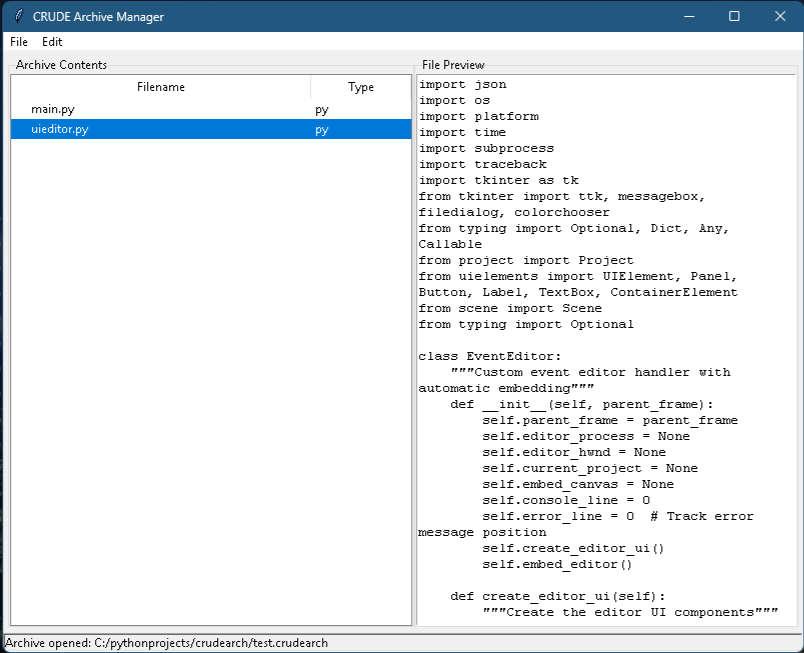
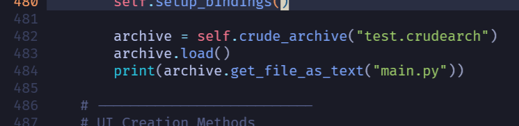
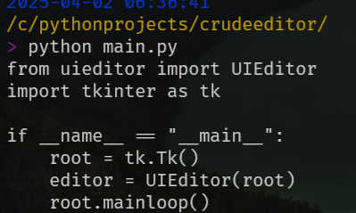

# Crude Archive - Usage Guide

## Table of Contents
1. [Setup Instructions](#setup)
2. [Using ArchiveHandler (Programmatic)](#archivehandler)
3. [Using the GUI Manager](#gui-manager)
4. [Common Operations](#common-operations)

---

## <a name="setup"></a>1. Setup Instructions

### Requirements
- Python 3.7 or newer
- No additional dependencies needed

### Installation
Choose **one** of these methods:

#### Method A: Direct Copy
1. Download the `crudearch` folder
2. Place it in your project's root directory
3. Import with `from crudearch import CrudeArchiveHandler`

#### Method B: Git Clone
```bash
git clone https://github.com/yourusername/crudarchive.git
cd crudarchive
```

## <a name="archivehandler"></a>2. Using ArchiveHandler
Basic Workflow

1. Initialize a new archive handler
2. Create/Load an archive file
3. Perform operations (add/remove/extract)
4. Save changes

Example: Creating an Archive

```python

from crudearch import CrudeArchiveHandler

# Step 1: Initialize
archive = CrudeArchiveHandler("project.crudearch")

# Step 2: Create new archive
archive.create("project.crudearch")

# Step 3: Add content
archive.add_dict_as_json("config.json", {"key": "value"})
archive.add_text_data("notes.txt", "Important project notes")

# Step 4: Save
archive.save()
```
Key Methods
Method	Description
add_file()	Add any file type from disk
add_text_data()	Add string content directly
add_dict_as_json()	Store dictionaries as JSON
get_file()	Retrieve raw file content
get_file_as_text()	Get content as decoded string
<a name="gui-manager"></a>3. Using the GUI Manager
Launching the GUI

```bash
python -m crudearch.manager
```
or
```bash
python -m crudearch/manager.py
```


First-Time Walkthrough

- Create a new archive (File → New)

1. Add files:
    - Drag-and-drop files into the window, or
    - Use Edit → Add File
2. Preview files by clicking them
3. Save your archive (File → Save)



GUI Workflow
Hotkeys

- Ctrl+N: New archive
- Ctrl+O: Open archive
- Ctrl+S: Save
- Del: Remove selected file

<a name="common-operations"></a>4. Common Operations
Programmatic
``` python
# Extract JSON data
config_data = json.loads(archive.get_file_as_text("config.json"))

# Update a file
archive.add_text_data("notes.txt", "Updated notes content")

# List all files
for filename in archive.list_files():
    print(filename)
```
In a seperate project we will test by puttinng this snippeting into
the __init__ to see if we can retrive anything when it initializes



This was the result

 


GUI Operations

- Import folder: File → Import Directory
- Export file: Right-click → Export
- Switch theme: Edit → Toggle Theme


#### Below are some examples


## OpenGL/Numpy Integration

```python
from crudearch import CrudeArchiveHandler
import numpy as np
from OpenGL.GL import *

def load_model(archive_path, model_name):
    archive = CrudeArchiveHandler(archive_path)
    archive.load()
    
    if model_name.endswith('.obj'):
        # Get vertices as numpy array
        vertices = archive.get_model_as_numpy(model_name)
        
        # OpenGL setup
        vbo = glGenBuffers(1)
        glBindBuffer(GL_ARRAY_BUFFER, vbo)
        glBufferData(GL_ARRAY_BUFFER, vertices.nbytes, vertices, GL_STATIC_DRAW)
        return vbo
```
## Animation Handeling

```python
# Create archive with 3D model
archive = CrudeArchiveHandler("game_assets.crudearch")
with open("character.fbx", "rb") as f:
    archive.add_3d_model("hero.fbx", f.read(), lod_levels=3)

# Access model features

animations = archive.get_animations("hero.fbx")
low_poly = archive.get_model_lod("hero.fbx", lod_level=2)

# Update animation at runtime
new_anim = {
    "name": "attack",
    "frames": 24,
    "tracks": [...] 
}
archive.update_model_animation("hero.fbx", new_anim)
archive.save()

```
# Audio And Video

### Media info
```python
archive = CrudeArchiveHandler("game_assets.crudearch")
archive.add_image("screenshot.png", image_data)
archive.add_media_file("background.mp4", "/path/to/video.mp4")
```
### Add and inspect audio
```python
archive = CrudeArchiveHandler("game_assets.crudearch")
archive.add_audio("track.mp3", mp3_data)
print(archive.get_media_info("track.mp3"))
```
### Add and inspect video
```python
archive = CrudeArchiveHandler("game_assets.crudearch")
archive.add_video("clip.mp4", mp4_data)
print(archive.get_media_info("clip.mp4"))
```
### For Tkinter GUI
```python
archive = CrudeArchiveHandler("game_assets.crudearch")
cover = archive.get_audio_cover("song.mp3", "tkinter")
label = tk.Label(image=cover)
label.image = cover  # Keep reference
```
### For PyGame
```python
archive = CrudeArchiveHandler("game_assets.crudearch")
cover = archive.get_audio_cover("track.flac", "pygame")
screen.blit(cover, (x, y))
```
### For OpenGL (returns numpy array)
```python
archive = CrudeArchiveHandler("game_assets.crudearch")
cover_array = archive.get_audio_cover("album.mp3", "OPENGL")
texture = glGenTextures(1)
glTexImage2D(GL_TEXTURE_2D, 0, GL_RGB, *cover_array.shape[:2], 0, 
             GL_RGB, GL_UNSIGNED_BYTE, cover_array)
```
# Working with fonts

### All these work:
```python
font = archive.get_font("arial.ttf")
font = archive.get_font("Arial")  # Case-insensitive
font = archive.get_font("/fonts/arial.ttf")  # Path-style
```
### Get all fonts with basic info
```python
all_fonts = archive.get_all_fonts()
```
### Get deep metadata for one font
```python
font_details = archive.get_font_details("arial.ttf")
```
### Adding Fonts
```python
archive = CrudeArchiveHandler("game_assets.crudearch")
with open("arial.ttf", "rb") as f:
    archive.add_font("arial.ttf", f.read())
```
### Get raw font data
```python
archive = CrudeArchiveHandler("game_assets.crudearch")
font_data = archive.get_font("arial")
```
### Get all fonts summary
```python
archive = CrudeArchiveHandler("game_assets.crudearch")
for name, info in archive.get_all_fonts().items():
    print(f"{name}: {info['type']}, {info['size']} bytes")
```
### Get detailed metadata
```python
archive = CrudeArchiveHandler("game_assets.crudearch")
details = archive.get_font_details("arial.ttf")
print(f"Font contains {details['tables']} tables")
``
# Text System Integration

### PyGame example
```python
archive = CrudeArchiveHandler("game_assets.crudearch")
font_data = archive.get_font("arial.ttf")
with open("temp_font.ttf", "wb") as f:
    f.write(font_data)
pygame.font.Font("temp_font.ttf", 16)
```
### PIL/Pillow example
```python
archive = CrudeArchiveHandler("game_assets.crudearch")
from PIL import ImageFont, ImageDraw
font_data = archive.get_font("arial.ttf")
font = ImageFont.truetype(io.BytesIO(font_data), size=12)
```
### Get all fonts with data and metadata
```python
archive = CrudeArchiveHandler("game_assets.crudearch")
all_fonts = archive.get_all_fonts()
```
### Access font data and metadata
```python
for font_name, font_info in all_fonts.items():
    print(f"Font: {font_name}")
    print(f"Size: {len(font_info['data'])} bytes")
    print(f"Tables: {font_info['metadata'].get('tables', 'unknown')}")
```    
### Example: Save font to disk
```python
with open(font_name, "wb") as f:
    f.write(font_info['data'])
```

## 1. Core Archive Operations
- `create(filename: str)`  
  Create a new empty archive with the specified filename.
- `load()`  
  Load an existing archive from disk (supports 3D metadata).
- `save()`  
  Save the archive to disk (includes 3D metadata).
- `list_files()`  
  List all files in the archive.
- `remove_file(name: str)`  
  Remove a file from the archive by name.
- `import_directory(dir_path: str)`  
  Import all files from a directory into the archive.


## File Handling
- `add_file(name: str, content: Union[bytes, str], file_type: str = None)`  
  Add a file to the archive with optional type detection.
- `get_file(name: str)`  
  Retrieve raw file content by name.
- `get_file_info(name: str)`  
  Get metadata (type, content) for a file.
- `get_file_mime_type(filename: str)`  
  Get the MIME type of an archived file.
- `get_file_as_text(name: str, encoding: str = 'utf-8')`  
  Retrieve file content as decoded text.
- `get_text_lines(filename: str)`  
  Get text file content as a list of lines.
- `validate_media_file(data: bytes, file_type: str)`  
  Validate media files by magic numbers/structure.


## Text File Operations
- `add_text_file(name: str, text: str, encoding: str = 'utf-8')`  
  Add a text file to the archive.
- `add_text_data(filename: str, text_data: str, file_type: str = None)`  
  Add text data directly with optional file type.
- `append_text(filename: str, text: str)`  
  Append text to an existing file.
- `prepend_text(filename: str, text: str)`  
  Prepend text to an existing file.
- `replace_text(filename: str, old: str, new: str)`  
  Replace all occurrences of text in a file.
- `insert_text_at_index(filename: str, text: str, index: int)`  
  Insert text at a specific position in a file.
- `insert_text_at_position(filename: str, text: str, row: int, col: int)`  
  Insert text at a specific row/column position.
- `truncate_text_row(filename: str, start: int, end: int)`  
  Remove text between indices and shift content left.
- `remove_text_row_at_index(filename: str, row: int, col_start: int, col_end: int)`  
  Remove text from specific row/columns without shifting lines.
- `remove_text_column(filename: str, col_start: int, col_end: int)`  
  Remove a vertical column range from all lines.

## JSON Operations
- `add_dict_as_json(filename: str, data_dict: dict, indent: int = 2)`  
  Add a dictionary as a JSON file to the archive.
- `update_json_value(filename: str, key: str, value: Any)`  
  Update a value in a JSON file.

## Media-Specific Operations
- `add_media_file(name: str, file_path: str)`  
  Add a media file (image/audio/video) with automatic type detection.
- `add_image(name: str, image_data: bytes)`  
  Add an image with validation and metadata extraction.
- `add_audio(name: str, audio_data: bytes)`  
  Add audio data with metadata extraction.
- `add_video(name: str, video_data: bytes)`  
  Add video data with metadata extraction.
- `get_image_data(name: str)`  
  Retrive raw image and meta data from file
- `get_audio_data(name: str)`  
  Retrive raw audio and meta data from file
- `get_video_data(name: str)`  
  Retrive raw video and meta data from file 
- `get_media_info(filename: str)`  
  Retrieve metadata for media files (images/audio/video).
- `get_audio_cover(filename: str, renderer: str = None)`  
  Extract embedded cover art from audio files (supports multiple renderers).

## 3D Model Operations
- `add_3d_model(name: str, file_path: str, optimize: bool = True)`  
  Add a 3D model with optional optimization.
- `add_3d_data_model(name: str, data: bytes, lod_levels: int = 1, include_textures: bool = False)`  
  Add 3D model data with LOD generation and feature extraction.
- `get_model_lod(name: str, lod_level: int = 0)`  
  Retrieve a specific Level of Detail (LOD) version of a model.
- `get_animations(name: str)`  
  Get animation data for a 3D model.
- `update_model_animation(name: str, anim_data: Dict)`  
  Add/update animation data for a model.
- `get_model_as_numpy(filename: str)`  
  Convert supported 3D models (e.g., OBJ) to numpy arrays.

## Numeric Data Operations
- `add_numeric_data(name: str, array: np.ndarray, compress: bool = True)`  
  Add a numpy array as `.npy` or `.npz` (compressed).
- `get_numeric_data(name: str)`  
  Retrieve numeric data as a numpy array.

## Font Operations
- `add_font(name: str, font_data: bytes)`  
  Add a font file with validation.
- `get_font(identifier: str)`  
  Retrieve font data by filename or path.
- `get_all_fonts()`  
  Get all fonts in the archive with metadata.
- `get_font_details(identifier: str)`  
  Get detailed metadata for a specific font.

## Binary Data Operations
- `add_binary_data(filename: str, binary_data: bytes, file_type: str = None)`  
  Add raw binary data to the archive.
- `get_binary_data(filename: str)`
  Get raw binary and meta data from a file in the archive.

## Utility Functions
- `is_restricted_type(file_type: str)`  
  Check if a file type is restricted (e.g., `.exe`, `.dll`).
- `validate_file_type(file_type: str)`  
  Validate if a file type is supported and not restricted.

