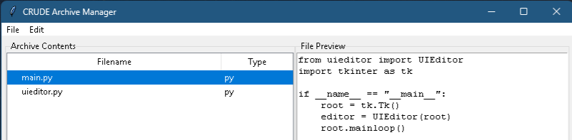

# Crude Archive Manager


CrudeArchive is a archiving package to add remove and write and edit documents and binary's directly to a archive written in python.
A lightweight, dependency-free solution for managing custom `.crudearch` file archives with both programmatic and GUI interfaces.

## Why Crude Archive?

- **Zero Dependencies** - Pure Python (3.7+) using only standard libraries
- **Dual Interface** - Use programmatically or via intuitive GUI
- **Small Footprint** - Entire package <100KB
- **Fast Operations** - In-memory buffer management
- **Cross-Platform** - Works anywhere Python runs
- **Coming Soon** - Standalone executables for Windows/macOS/Linux

## Package Structure

```text
crudearch/
├── __init__.py
├── archive_handler.py # Core operations
├── common.py          # Shared utilities
├── HOW_TO_USE.md.py   # Detailed how to use document
├── manager.py         # GUI application
├── README.py          # Read before using important information described
└── setup.py           # Setup install via pip
```
Key Features
Core Functionality
### Key Features

| Feature               | GUI   | API   | Description                                                  |
|-----------------------|-------|-------|--------------------------------------------------------------|
| Create archives       | ✔️    | ✔️    | Create, read, update, and delete archives with a single API  |
| Edit archive contents | ✔️    | ✔️    | Work with data directly witout temporary files               |
| Preview files         | ✔️    | ✔️    | Create/open/save archives through intuitive interface        |
| Import folders        | ✔️    | ✔️    | Import entire directories at oncc                            |
| Drag-and-drop         | ✔️    | ❌    | Easily add files directly in the application                 |
| Dark/light mode       | ✔️    | ❌    | Automatic dark/light mode matching system preference         |


Getting Started

For Python Developers - python

from crudearch import CrudeArchiveHandler

# Create and use an archive
```python
archive = CrudeArchiveHandler("project.crudearch")
archive.create("project.crudearch")
archive.add_dict_as_json("config.json", {"app": "Crude Archive", "version": 1.0})
archive.save()
```


For End Users - bash

# Run the GUI from source
```bash
python -m crudearch/manager.py
```
# Coming soon - standalone executables:
./CrudeArchiveManager  # Linux/macOS
CrudeArchiveManager.exe  # Windows

Installation
Option 1: Direct Copy (No Installation)

- Download the crudearch folder
- Place it in your project directory
- Import as shown in the examples above

Option 2: Pip Install (Coming Soon) - bash
```bash
pip install crudearch
```
Roadmap

- Core archive functionality (v1.0)

- Graphical interface (v1.0)

- Windows executable (v1.1)

- macOS application bundle (v1.2)

- Linux AppImage (v1.2)


### Current vs. Planned

| Component         | Status            | Notes                     |
|-------------------|-------------------|---------------------------|
| Python API        | ✅ Stable         | Full functionality        |
| GUI (source)      | ✅ Stable         | Run with Python           |
| Windows EXE       | 🔄 Beta Testing   | Coming v1.1               |
| macOS App         | 🛠 In Development | Planned v1.2              |
| Linux Binaries    | 🛠 In Development | Planned v1.2              |

Support This Project

While this software is completely free, your support helps ensure its continued development:

Donate
☕ Buy me a coffee
License
